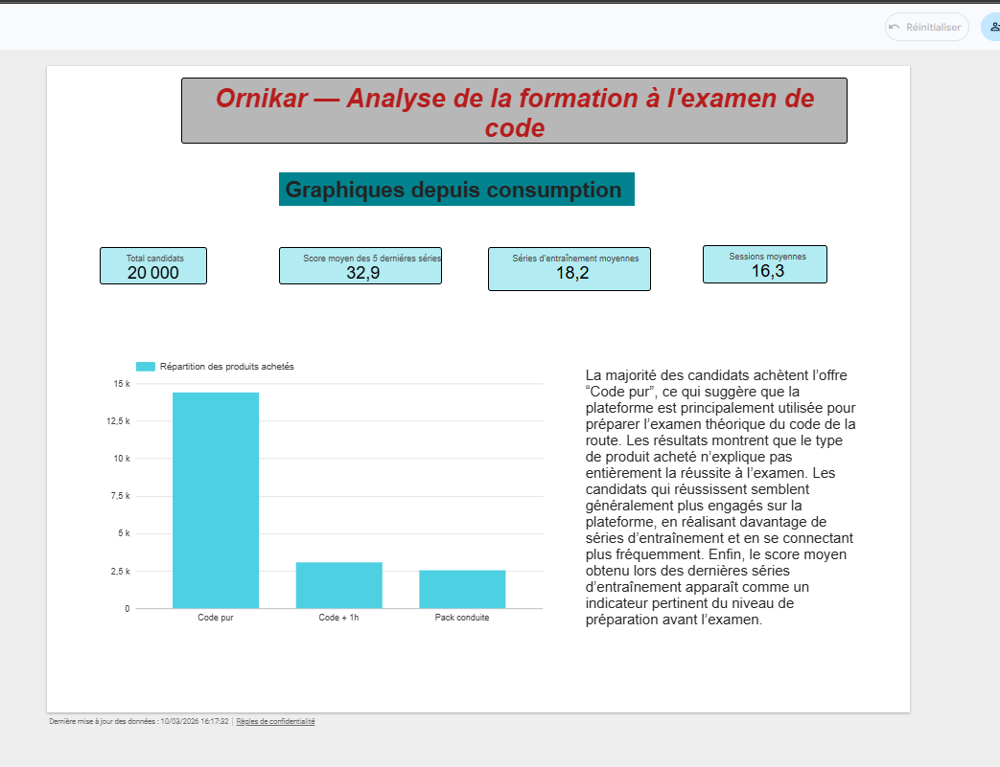
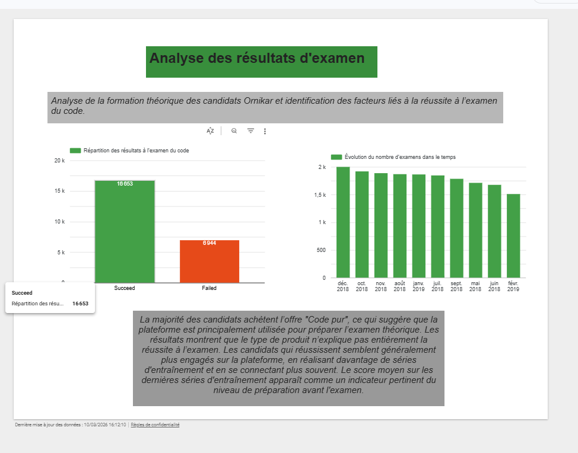

# ornikar-driving-exam-analysis
Analyse des données de formation à l'examen du code de la route d'Ornikar à l'aide de SQL (BigQuery) et Looker Studio.
Analyse des données de formation à l'examen théorique du permis de conduire (données Ornikar) à l'aide de SQL et Looker Studio. Ce projet explore l'engagement des candidats, leurs performances lors des entraînements et les facteurs liés à la réussite à l'examen.
## Dashboard Preview

### Training Engagement

### Exam Results

